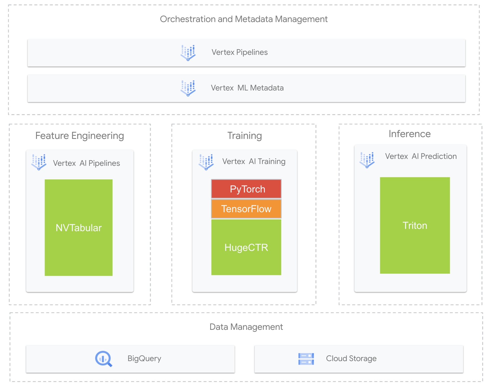
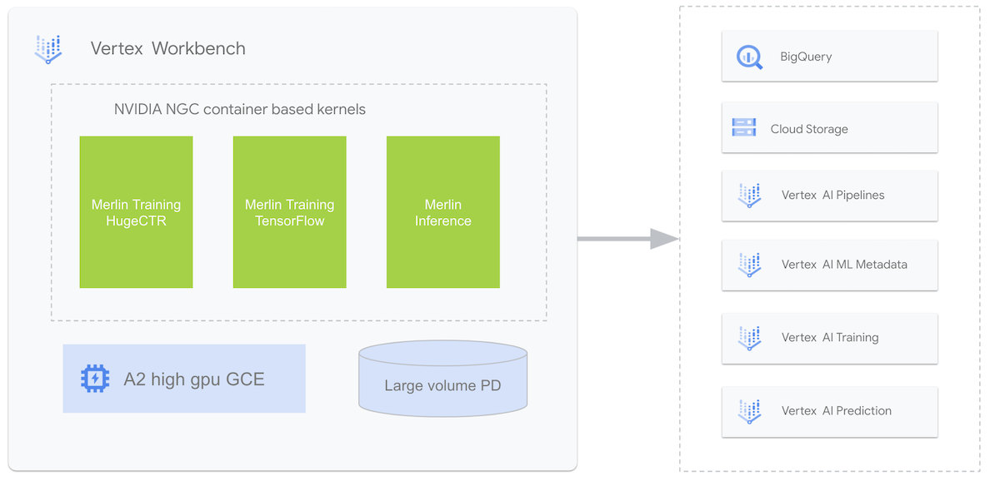
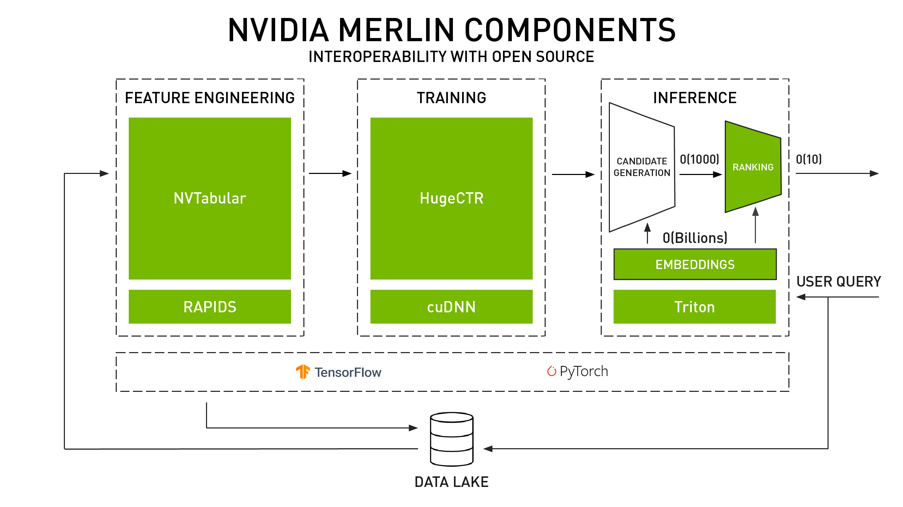
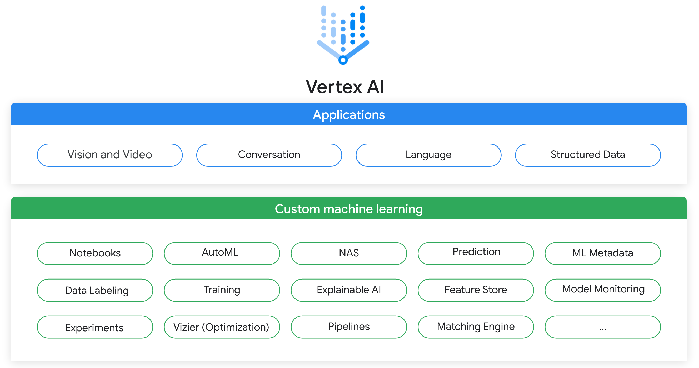

# [WiP] NVIDIA Merlin on Vertex AI

This repository compiles prescriptive guidance and code samples for operationalization of [NVIDIA Merlin framework](https://developer.nvidia.com/nvidia-merlin) on [Google Cloud Vertex AI](https://cloud.google.com/vertex-ai).

[NVIDIA Merlin](https://developer.nvidia.com/nvidia-merlin) is and open-source framework for building large-scale deep learning recommender system. [Vertex AI](https://cloud.google.com/vertex-ai) is Google Cloud's unified Machine Learning platform to help data scientists and machine learning engineers increase experimentation, deploy faster, and manage models with confidence.

The content in this repository centers around five core scenarios:

- Setting up Merlin experimentation and development environment in [Vertex AI Workbench](https://cloud.google.com/vertex-ai-workbench). 
- Operationalizing large scale data preprocessing pipelines with [NVIDIA Merlin NVTabular](https://developer.nvidia.com/nvidia-merlin/nvtabular) and [Vertex AI Pipelines](https://cloud.google.com/vertex-ai/docs/pipelines/introduction).
- Training large-scale deep learning ranking models with [NVIDIA Merlin HugeCTR](https://github.com/NVIDIA-Merlin/HugeCTR) and [Vertex AI Training](https://cloud.google.com/vertex-ai/docs/training/custom-training).
- Deploying models and serving predictions with [NVIDIA Triton Inference Server](https://developer.nvidia.com/nvidia-triton-inference-server) and [Vertex AI Prediction](https://cloud.google.com/vertex-ai/docs/predictions/getting-predictions)
- Implementing end to end data preprocessing, training, and deployment pipelines with [Vertex AI Pipelines](https://cloud.google.com/vertex-ai/docs/pipelines/introduction).

We assume that users of this repository have practical experience with both *NVIDIA Merlin* and *Vertex AI*. If you are unfamiliar with some of the core concepts or technologies used in this repo we recommend referring to  [NVIDIA Merlin](https://developer.nvidia.com/nvidia-merlin) and [Vertex AI](https://cloud.google.com/vertex-ai) documentation. 

The dataset used by all samples in this repo is [Criteo 1TB Click Logs dataset](https://ailab.criteo.com/download-criteo-1tb-click-logs-dataset/) provided by [The Criteo AI Lab](https://ailab.criteo.com/about-us/). 


## Architecture Overview

The below figure summarizes a high level architecture of the solution demonstrated in this repo.




### Large scale data preprocessing

Commercial recommenders are trained on huge datasets, often several hundreds of terabytes in size. At this scale, data preprocessing steps often take much more time than training recommender machine learning models. [NVTabular](https://developer.nvidia.com/nvidia-merlin/nvtabular) - a core component of *Merlin* - is a feature engineering and preprocessing library designed to effectively manipulate terabytes of recommender system datasets and significantly reduce data preparation time. 

In this repo we demonstrate how to operationalize NVTabular data preprocessing workflows using Vertex AI Pipelines and multi-GPU processing nodes. The repo includes two samples of reusable and customizable data preprocessing pipelines developed using [Kubeflow Pipelines SDK](https://www.kubeflow.org/docs/components/pipelines/sdk/sdk-overview/) and [Google Cloud pipeline components](https://cloud.google.com/vertex-ai/docs/pipelines/build-pipeline#google-cloud-components). 

The first pipeline demonstrates how to process large CSV datasets managed in [Google Cloud Storage](https://cloud.google.com/storage). The second pipeline digests source data from [Google BigQuery](https://www.google.com/search?q=bigquery&oq=bigquery&aqs=chrome..69i57j0i512l9.1610j0j15&sourceid=chrome&ie=UTF-8)

### Training large-scale deep learning recommender models

[NVIDIA HugeCTR](https://github.com/NVIDIA-Merlin/HugeCTR) is NVIDIA's GPU-accelerated, highly scalable recommender framework. NVIDIA HugeCTR facilitates  implementations of leading deep learning recommender models such as [Google's Wide and Deep](https://arxiv.org/abs/1606.07792) and, [Facebook's DLRM](https://arxiv.org/abs/1703.04247).

The repo includes an example of how to operationalize training and hypertuning of the HugeCTR implementation of the [DeepFM](https://arxiv.org/abs/1703.04247) model using [Vertex AI Training](https://cloud.google.com/vertex-ai/docs/training/custom-training) and massively scalable [A2 workers](https://cloud.google.com/blog/products/compute/a2-vms-with-nvidia-a100-gpus-are-ga).

### Deploying and serving deep learning ranking inference pipelines 

[NVIDIA Triton Inference Server](https://developer.nvidia.com/nvidia-triton-inference-server) is a cloud and edge inferencing solution optimized for both CPUs and GPUs. Triton supports ensemble models that can be used to implement multi-step inference pipelines. 

The repo includes a sample that demonstrates how to create, deploy, and serve a Triton ensemble model using Vertex AI Prediction. The example ensemble implements an inference pipeline that integrates NVTabular data preprocessing workflow with a HugeCTR deep learning model. 

### End to end MLOps workflow

Design patterns and best practices outlined in the previous sections come together in the last component of the solution - a reference implementation the machine learning pipeline that integrates data preprocessing, training, and deployment into a unified end to end workflow.

### Experimentation and development environment

A flexible and powerful experimentation and development environment is critical in recommender system projects. In the environment setup section of this repo we outline steps to configure the environment depicted on the below figure. 



The environment is based on [Vertex AI Workbench](https://cloud.google.com/vertex-ai/docs/workbench/introduction). NVIDIA NGC [Merlin training]() and [Merlin inference]() container images are installed as managed notebooks kernels augmenting the standard features of a managed notebook instance that include UI and programmatic interfaces to Google Cloud services.


## Repository structure

The core content of the repository comprises a series of Jupyter notebooks and a set of Python modules. The notebooks compile detailed guidance on implementing the  solution's components described at a high level in the previous section. The Python modules encapsulate reusable code components that are used in the notebooks and in Vertex AI jobs and pipelines. 

Currently, the repo includes the following notebooks:

1. [00-dataset-management](00-dataset-management.ipynb) - describes and explores the Criteo dataset, and loads it to BigQuery.
2. [01-dataset-preprocessing](01-dataset-preprocessing.ipynb) - guidance for large scaled data preprocessing with NVTabular and Vertex Pipelines
3. [02-model-training-hugectr](02-model-training-hugectr.ipynb) - guidance for training HugeCTR models with Vertex Training. 
4. [03-model-inference-hugectr](03-model-inference-triton.ipynb) - guidance for deploying Trition ensemble models with Vertex Prediction
5. [04-e2e-pipeline](04-e2e-pipeline.ipynb) - guidance for building an end-to-end data preprocessing, training, and deployment pipeline

The Python modules are in the `src` folder:
- `src/pipelines` - pipeline and pipeline components definitions
- `src/preprocessing` - data preprocessing utility functions and classes
- `src/serving` - deployment and serving utility functions and classes
- `src/training` - model definitions and training loops

The `src` folder also includes Dockerfiles for custom container images used by Vertex Pipelines, Vertex Training, and Vertex Prediction. Refer to the notebooks for more detailed information.


## Environment setup

### Enabling the required services
From Cloud Shell, run the following `gcloud` command to enable the required Cloud APIs:
```
PROJECT_ID=merlin-on-gcp
gcloud services enable \
    aiplatform.googleapis.com         \
    bigquery.googleapis.com           \
    bigquerystorage.googleapis.com    \
    cloudapis.googleapis.com          \
    cloudbuild.googleapis.com         \
    compute.googleapis.com            \
    containerregistry.googleapis.com  \
    notebooks.googleapis.com          \
    storage.googleapis.com            \
    --project=${PROJECT_ID}
```


### Creating Merlin development container image
From Cloud Shell

1. Get Dockerfile for the Merlin development image:
```
SRC_REPO=https://github.com/GoogleCloudPlatform/merlin-on-vertex
LOCAL_DIR=merlin-env-setup
kpt pkg get $SRC_REPO/env@main $LOCAL_DIR
cd $LOCAL_DIR
```
2. Build and push the development image
```
PROJECT_ID=merlin-on-vertex # change to your project id.
IMAGE_URI=gcr.io/${PROJECT_ID}/merlin-dev-vertex
gcloud builds submit --timeout "2h" --tag ${IMAGE_URI} . --machine-type=e2-highcpu-8
```

### Creating and configuring an instance of Vertex Workbench managed notebook

1. Follow the instructions in the [Create a managed notebooks instance how-to guide](https://cloud.google.com/vertex-ai/docs/workbench/managed/create-instance):
    * In the [Use custom Docker images settings](https://cloud.google.com/vertex-ai/docs/workbench/managed/create-instance#expandable-2) enter a name of the image you created in the previous step: `gcr.io/<your-project-id>/merlin-dev-vertex:latest`
    * In the [Configure hardware settings](https://cloud.google.com/vertex-ai/docs/workbench/managed/create-instance#expandable-3) select your GPU configuration. We recommend a machine with two `NVIDIA Tesla T4` or `NVIDIA Tesla A100` GPUs. 

### Run the example
After the Vertex Workbench managed notebook is created, peform the following steps:

1. Click on the OPEN JUPYTERLAB link on the notebook instance.
2. Click on the New Launcher button, then start a new terminal session.
3. Clone the repository to your notebook instance:
    ```
    git clone https://github.com/GoogleCloudPlatform/merlin-on-vertex.git
    cd merlin-on-vertex
    ```
    
    
    
 With the rapid growth in scale of industry datasets, Deep Learning (DL) recommender models have started to gain advantages over traditional methods. At the same time, the complexity of building such systems has grown to the point where special thought must be taken in both the preparation of the data and in the training methods used in order to avoid performance issues that can slow down the total training iteration time by orders of magnitude.

The combination of more sophisticated models and rapid data growth has raised the bar for computational resources required for data preprocessing and training while also placing new burdens on production systems. The current challenges for training large-scale recommenders include:

* **Huge datasets**: Commercial recommenders are trained on huge datasets, often several terabytes in scale. At this scale, data ETL and preprocessing steps often take much more time than training the DL model.
* **Complex data preprocessing and feature engineering pipelines**: Datasets need to be preprocessed and transformed into a form relevant to be used with DL models and frameworks. In addition, feature engineering creates an extensive set of new features from existing ones, requiring multiple iterations to arrive at an optimal solution.
* **Input bottleneck**: Data loading, if not well optimized, can be the slowest part of the training process, leading to under-utilization of high-throughput computing devices such as GPUs.
* **Extensive repeated experimentation**: The whole data engineering, training, and evaluation process is generally repeated many times, requiring significant time and computational resources.

To meet the computational demands for large-scale DL recommender systems training and inference, NVIDIA introduced Merlin, an application framework and ecosystem created to facilitate all phases of building a DL recommender system, accelerated on NVIDIA GPUs. NVIDIA Merlin includes the following components:

1. [NVTabular](https://developer.nvidia.com/nvidia-merlin/nvtabular) - a feature engineering and preprocessing library designed to effectively manipulate terabytes of recommender system datasets and significantly reduce data preparation time.
2. [HugeCTR](https://developer.nvidia.com/nvidia-merlin/hugectr) -  a deep neural network training framework designed for recommender systems. It provides distributed training with model-parallel embedding tables and data-parallel neural networks across multiple GPUs and nodes for maximum performance.
3. [Triton](https://developer.nvidia.com/nvidia-triton-inference-server) - an inference server to serve model efficiently on GPUs by maximizing throughput with the right combination of latency and GPU utilization.

In addition, you can use NVIDIA Merlin components when you are building your TensorFlow or PyTorch DL recommender models, by using NVTabular to preprocess your data, using NVTabular data loaders to feed the data to your model efficiently during training, and using Triton server to serve your trained model.




[Verex AI](https://cloud.google.com/vertex-ai) is Google Cloud's unified data science and ML platform to build, deploy, and operationalize custom AI systems at scale.
Vertex AI provides a suite of managed service for MLOps processes, including experimentation, model training, model serving, metadata tracking, and model monitoring,
as well as pipeline workflow orchestration. 

This code repository shows how to use Vertex AI services to run the various components of NVIDIA Merlin framework: NVTabular, HugeCTR, and Triton, to build and deploy large scale DL recommender models on Google Cloud.




